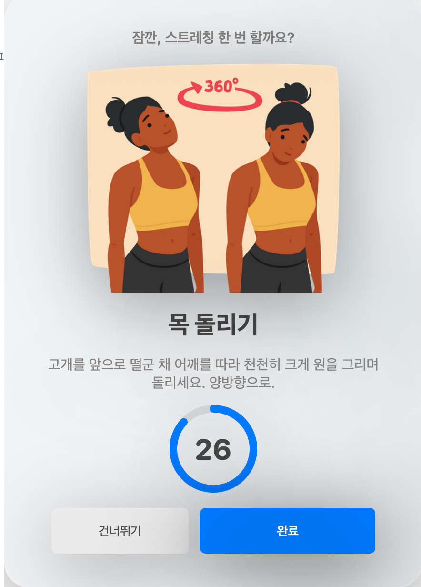

# 데스크 스트레칭 (DeskStretch)

장시간 착석하는 화이트칼라를 위한 macOS 메뉴바 스트레칭 알리미.
근무 시간대 안에서 일정 간격마다 화면 정중앙에 스트레칭 안내(일러스트)를 띄운다.

> Apple Silicon(arm64) 전용. macOS 13 이상.

<p align="center">
  
</p>

## 특징
- 메뉴바 상주 + 움직이는 아이콘 (RunCat식)
- 출근 / 점심 / 퇴근 시간 설정, 그 시간대 안에서만 알림 (주말 제외 가능)
- 연구 기반 기본 간격 30분 (5~120분 조절)
- 화면 중앙 오버레이 + 동작별 일러스트, "완료" / "건너뛰기"
- 로그인 시 자동 실행 토글

## 설치

### 방법 1. 다운로드 (권장)
1. [Releases](../../releases)에서 `DeskStretch.zip` 을 받아 압축을 푼다.
2. `DeskStretch.app` 을 `/Applications` 로 옮긴다.
3. **격리 속성 제거 — 이 한 줄이 반드시 필요하다:**
   ```bash
   xattr -dr com.apple.quarantine /Applications/DeskStretch.app
   ```
4. 실행:
   ```bash
   open /Applications/DeskStretch.app
   ```

> **왜 `xattr` 가 필요한가?** 이 앱은 Apple 공증(notarization)을 받지 않았다.
> 그래서 인터넷에서 받은 앱에는 격리 딱지가 붙어 *"손상되어 열 수 없음"* 경고가 뜬다.
> 위 명령으로 딱지를 떼면 정상 실행된다. (또는 시스템 설정 → 개인정보 보호 및 보안 → "확인 없이 열기")

### 방법 2. 직접 빌드 (개발자용)
Xcode는 불필요하고 **Command Line Tools** 만 있으면 된다.
```bash
xcode-select --install   # CLT 미설치 시
./build.sh
open build/DeskStretch.app
```
로컬에서 직접 빌드한 앱은 격리 딱지가 안 붙어 `xattr` 단계가 필요 없다.

<details>
<summary><b>빌드가 modulemap / SDK 에러로 실패한다면</b></summary>

AppKit·Foundation 같은 기본 프레임워크조차 컴파일이 안 되고, 빌드가 몇 분씩 끌다 실패한다면
**CLT 부분 업데이트 꼬임**일 수 있다. 증상:
- `module.modulemap` / `bridging.modulemap` 의 `SwiftBridging` 모듈 중복 정의 에러
- 컴파일러와 SDK 빌드 버전이 미세하게 어긋남

해결은 **CLT 깨끗한 재설치**:
```bash
sudo rm -rf /Library/Developer/CommandLineTools
sudo xcode-select --install
```
설치 후 `swiftc --version` 이 최신인지 확인하고 다시 `./build.sh`.
</details>

## 실행 / 자동 실행
> 자동 실행을 켜면 현재 실행 중인 앱의 경로를 LaunchAgent에 등록한다.
> 따라서 **먼저 `/Applications`로 옮기고 거기서 실행한 다음** "로그인 시 자동 실행"을 켜는 것을 권장한다.
> (그래야 경로가 안정적이다.)

## 사용
- 첫 실행 시 설정 창에서 출근/점심/퇴근 시간과 간격을 정한다.
- 메뉴바 아이콘 클릭 → `지금 스트레칭하기`(즉시 테스트), `일시정지/재개`, `설정…`, `종료`.

## 구조
- `Sources/` — Swift 소스 (AppKit + SwiftUI)
- `Resources/illustrations/` — 동작별 일러스트 PNG (파일명 = `StretchKind` 값)
- `build.sh` — `swiftc`로 컴파일 후 `.app` 번들 + 리소스 복사 + Info.plist + ad-hoc 코드사인 + zip 패키징
- `docs/plan/` — 구현 계획

## 릴리스 만들기 (메인테이너)
```bash
./build.sh                                   # build/DeskStretch.zip 까지 생성됨
gh release create v1.0 build/DeskStretch.zip --title "v1.0" --notes "..."
```

## 자동 실행 끄기
설정에서 토글을 끄거나:
```bash
rm ~/Library/LaunchAgents/com.jiwon.deskstretch.plist
```
